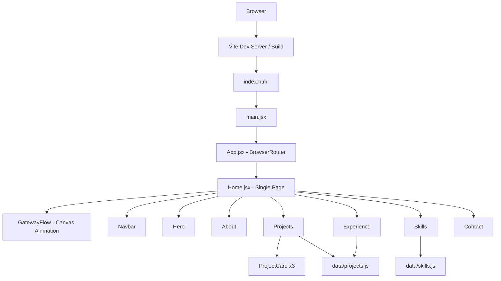

# INTERVIEW TECHNICAL DEEP DIVE
## Portfolio Website — Suwanich Silaon

> เอกสารนี้สร้างจาก Source Code จริงของ Repository  
> เป้าหมาย: ใช้เตรียมตอบคำถาม Technical Interview สำหรับตำแหน่ง Software Developer / Internship

---

## สารบัญ

1. [Project Overview](#1-project-overview)
2. [Technology Stack Deep Dive](#2-technology-stack-deep-dive)
3. [System Architecture](#3-system-architecture)
4. [Application Folder Structure](#4-application-folder-structure)
5. [Application Flow](#5-application-flow)
6. [Component Architecture](#6-component-architecture)
7. [State Management & React Patterns](#7-state-management--react-patterns)
8. [Canvas Animation — GatewayFlow](#8-canvas-animation--gatewayflow)
9. [Data Layer — projects.js & skills.js](#9-data-layer--projectsjs--skillsjs)
10. [Routing & Navigation](#10-routing--navigation)
11. [Styling Architecture](#11-styling-architecture)
12. [Build Tooling & Configuration](#12-build-tooling--configuration)
13. [Performance Considerations](#13-performance-considerations)
14. [Security Analysis](#14-security-analysis)
15. [Important Code Files](#15-important-code-files)
16. [Interview Questions — Basic → Advanced](#16-interview-questions--basic--advanced)
17. [Follow-up Question Chains](#17-follow-up-question-chains)
18. [คำตอบแบบพูดจริงในการสัมภาษณ์](#18-คำตอบแบบพูดจริงในการสัมภาษณ์)
19. [Project Story](#19-project-story)
20. [สิ่งที่ควรจำก่อนสัมภาษณ์](#20-สิ่งที่ควรจำก่อนสัมภาษณ์)
21. [Source Code Verification](#21-source-code-verification)

---

## 1. Project Overview

### Project คืออะไร

Portfolio Website ส่วนตัวของ Suwanich Silaon นักศึกษาสาขาวิทยาการคอมพิวเตอร์ ที่กำลังหาโอกาสฝึกงาน เว็บไซต์นี้ทำหน้าที่เป็น Digital Resume แบบ Interactive เพื่อแสดงทักษะ โปรเจกต์ และประสบการณ์ต่อผู้รับสมัครงาน

### ทำขึ้นเพื่อแก้ปัญหาอะไร

- Resume แบบ PDF ไม่สามารถแสดง Technical Skill ได้อย่างชัดเจน
- ต้องการแสดงให้เห็นว่าสามารถสร้าง Frontend Web Application จริงได้
- ต้องการ Showcase โปรเจกต์หลัก (Income & Expense Tracker) พร้อมรายละเอียดเชิง Technical

### Target User

ผู้รับสมัครงาน / HR / Technical Interviewer ที่ต้องการดูข้อมูลของผู้สมัครฝึกงาน

### Main Features (จาก Source Code จริง)

- Hero Section — แนะนำตัว พร้อม CTA ไปยังโปรเจกต์, Resume PDF, และ Contact
- About Section — สรุป Background และ Passion
- Projects Section — แสดง Featured Project (Income & Expense Tracker) พร้อม Image Carousel auto-play, Architecture Diagram, Key Features, Challenge & Solution, และ Other Projects Grid
- Skills Section — แสดง Technical Skills แบ่งตาม Category จาก Data File
- Experience Section — แสดงประสบการณ์จาก Data File
- Contact Section — Link ไปยัง Email และ GitHub
- GatewayFlow Background — Canvas-based Particle Animation แบบ Interactive

### ฉันรับผิดชอบส่วนไหน

ทำทั้งหมดคนเดียว ตั้งแต่ Design, Component Structure, Animation, Data Layer, จนถึง Build Configuration

### Technology Stack

| Layer | Technology |
|---|---|
| UI Framework | React 19 |
| Language | JavaScript (JSX) |
| Build Tool | Vite 8 |
| Routing | React Router DOM v7 |
| Styling | Plain CSS (CSS Custom Properties) |
| Animation | HTML5 Canvas API |
| Fonts | Google Fonts (Inter + JetBrains Mono) |
| Package Manager | npm |

### Architecture โดยรวม

```
Browser
  └── index.html
        └── main.jsx  (React Entry Point)
              └── App.jsx  (Router)
                    └── Home (Page)
                          ├── GatewayFlow  (Canvas Background)
                          ├── Navbar
                          ├── Hero
                          ├── About
                          ├── Projects  ← ใช้ data/projects.js
                          │     └── ProjectCard (x3)
                          ├── Skills    ← ใช้ data/skills.js
                          ├── Experience ← ใช้ data/projects.js
                          └── Contact
```

### Architecture Diagram (Mermaid)



---

## 2. Technology Stack Deep Dive

| Technology | ใช้ทำอะไร | อยู่ส่วนไหนของระบบ | เหตุผลที่ใช้ |
|---|---|---|---|
| **React 19** | สร้าง UI Component | ทุก Component | Component-based, Declarative UI ทำให้ Reuse ได้ |
| **JSX** | เขียน HTML ใน JavaScript | ทุก `.jsx` file | ทำให้ Component อ่านง่ายกว่า createElement |
| **Vite 8** | Build Tool, Dev Server, Hot Module Replacement | Build Process | เร็วกว่า Webpack ในการ Development |
| **React Router DOM v7** | Client-side Routing | App.jsx | เปลี่ยน URL โดยไม่ Reload หน้า |
| **HTML5 Canvas API** | วาด Particle Animation | GatewayFlow.jsx | ต้องการ Animation ที่ควบคุม Frame-by-Frame ได้ |
| **CSS Custom Properties** | Design Tokens (สี, Font, Spacing) | index.css → ทุก CSS file | เปลี่ยน Theme ได้จากที่เดียว |
| **Google Fonts** | Inter (Body), JetBrains Mono (Code/Tags) | index.css (import) | Inter = อ่านง่าย, Mono = ดู Technical |
| **requestAnimationFrame** | Loop Animation ของ Canvas | GatewayFlow.jsx | Sync กับ Browser Refresh Rate |
| **BezierCurve (cubic)** | วาดเส้น Path ของ Particle | GatewayFlow.jsx | ทำให้เส้นโค้งดูเป็นธรรมชาติ |
| **ESLint** | Linting / Code Quality | eslint.config.js | ตรวจจับ Bug และ Bad Pattern ก่อน Build |
| **npm** | Package Manager | package.json | จัดการ Dependencies |

> **สิ่งที่ไม่มีใน Source Code:**  
> ไม่พบ TypeScript, Redux, Zustand, Tailwind CSS, Sass/SCSS, Backend API, Database, Authentication  
> โปรเจกต์นี้เป็น Pure Frontend Static Site

---

## 3. System Architecture

### ประเภทของแอป

**Static Single-Page Application (SPA)**  
ไม่มี Backend, ไม่มี Database, ไม่มี API Call ออกไปข้างนอก  
ทุกอย่างอยู่ใน Browser ทั้งหมด

### Data Flow

```
User เปิด Browser
  ↓
Vite Serve index.html
  ↓
Browser โหลด main.jsx
  ↓
React Mount App Component
  ↓
BrowserRouter จับ URL "/"
  ↓
Render Home.jsx
  ↓
Home Render ทุก Section Component
  ↓
Projects.jsx Import data/projects.js (Static Data)
Skills.jsx Import data/skills.js (Static Data)
Experience.jsx Import experiences จาก data/projects.js
  ↓
GatewayFlow.jsx เริ่ม Canvas Animation Loop
  ↓
User เห็น Portfolio
```

### Frontend คืออะไรในโปรเจกต์นี้

React App ที่ Build ด้วย Vite อยู่ใน `/frontend` folder ทำหน้าที่ทั้งหมด  
ไม่มีแยก Backend ในโปรเจกต์นี้

### External Services ที่ใช้จริง

| Service | ใช้ทำอะไร | ใช้ที่ไหน |
|---|---|---|
| Google Fonts | โหลด Font Inter และ JetBrains Mono | index.css (@import) |

> ไม่มี API Call, ไม่มี External Database, ไม่มี CDN สำหรับ Asset อื่น

---

## 4. Application Folder Structure

```
frontend/
├── public/
│   ├── icons.svg
│   ├── Logoapp.png
│   ├── Resume_Suwanich_Silaon.pdf     ← Resume ที่ Download ได้จากปุ่มใน Hero
│   └── images/
│       └── projects/
│           └── income-expense/        ← รูป Screenshot 17 รูปของ Featured Project
│               ├── Startapp.jpg
│               ├── Login.jpg
│               └── ... (17 images)
├── src/
│   ├── main.jsx                       ← Entry Point, Mount React App
│   ├── App.jsx                        ← Router, กำหนด Route ทั้งหมด
│   ├── index.css                      ← Global CSS, Design Tokens (:root)
│   ├── App.css                        ← CSS เพิ่มเติม (บางส่วนเป็น Template ที่เหลือ)
│   ├── assets/                        ← ว่างเปล่า ไม่มีไฟล์
│   ├── data/
│   │   ├── projects.js                ← ข้อมูล featuredProject, otherProjects, experiences
│   │   └── skills.js                  ← ข้อมูล skills แบ่งตาม Category
│   ├── pages/
│   │   ├── Home.jsx                   ← Page หลัก Assembly ทุก Section
│   │   └── ProjectDetail.jsx          ← ว่างเปล่า (ยังไม่ได้ implement)
│   └── components/
│       ├── Background/
│       │   └── GatewayFlow/
│       │       ├── GatewayFlow.jsx    ← Canvas Particle Animation
│       │       └── GatewayFlow.css    ← Position Fixed, Full Screen
│       ├── Navbar/
│       │   ├── Nabar.jsx              ← Fixed Navbar + Scroll Detection
│       │   └── StyleNabar.css
│       ├── Hero/
│       │   ├── Hero.jsx               ← Intro Section + CTA Buttons
│       │   └── StyleHero.css
│       ├── About/
│       │   ├── About.jsx              ← About Me Card
│       │   └── StyleAbout.css
│       ├── Projects/
│       │   ├── Projects.jsx           ← Featured Project + Carousel + Other Projects
│       │   └── StylePro.css
│       ├── ProjectCard/
│       │   ├── ProjectCard.jsx        ← Card Component สำหรับ Other Projects
│       │   └── StyleProCard.css
│       ├── Skills/
│       │   ├── Skills.jsx             ← Skills Grid จาก Data
│       │   └── StyleSkill.css
│       ├── Experience/
│       │   ├── Experience.jsx         ← Experience Timeline จาก Data
│       │   └── StyleExperience.css
│       └── Contact/
│           ├── Contact.jsx            ← Footer + Contact Links
│           └── StyleContact.css
├── index.html
├── vite.config.js
├── eslint.config.js
└── package.json
```

### Data Flow ระหว่าง Files

```
data/projects.js
  ├── export featuredProject  → Projects.jsx (Image Carousel + Details)
  ├── export otherProjects    → Projects.jsx → ProjectCard.jsx (x3)
  └── export experiences      → Experience.jsx (Timeline)

data/skills.js
  └── export skills           → Skills.jsx (Grid)
```

---

## 5. Application Flow

### 5.1 App Startup Flow (จาก Code จริง)

```
1. Browser ร้องขอ index.html จาก Vite Server
   ↓
2. HTML โหลด <script type="module" src="/src/main.jsx">
   ↓
3. main.jsx: createRoot(document.getElementById('root')).render(...)
   React Mount เข้ากับ <div id="root"> ใน HTML
   ↓
4. App.jsx Render: BrowserRouter → Routes → Route path="/" → <Home />
   ↓
5. Home.jsx Render ตามลำดับ:
   a. <GatewayFlow />  → useEffect → canvas.getContext('2d') → resize() → render() loop
   b. <Navbar />       → useEffect → addEventListener('scroll', handleScroll)
   c. <Hero />         → Static JSX
   d. <About />        → Static JSX
   e. <Projects />     → Import data → useState(current=0) → useEffect → setInterval (auto-play 3s)
   f. <Skills />       → Import data → Render grid
   g. <Experience />   → Import data → Render list
   h. <Contact />      → Static JSX
```

### 5.2 User Interaction Flow

```
User Scroll ↓
  → window.scroll event → Navbar: setScrolled(true) → เพิ่ม border-bottom

User คลิกบน Canvas ↓
  → click event → explosions.push({x, y, radius:0, life:1})
  → render loop: วาด ripple effect ออกจากจุดที่คลิก → Particle ถูกผลักออก

User คลิก Image Carousel ↓
  → handlePrev/handleNext → setCurrent(prev ± 1) → resetTimer() → รูปเปลี่ยน
  หรือ autoplay: setInterval 3000ms → setCurrent(next) อัตโนมัติ

User คลิก Download Resume ↓
  → anchor tag href="/Resume_Suwanich_Silaon.pdf" target="_blank"
  → Browser เปิดหรือ Download PDF จาก /public folder

User คลิก Email Me ↓
  → href="mailto:suwnitsilaon@gmail.com"
  → Browser เปิด Email Client

User คลิก GitHub ↓
  → href="https://github.com/suwanich-Siss" target="_blank"
  → Browser เปิด Tab ใหม่
```

---

## 6. Component Architecture

### Component Tree และ Props Flow

```
Home.jsx (Page — ไม่รับ Props)
  ├── GatewayFlow (รับ props: speed, density, opacity, ripple ฯลฯ)
  │   └── ใช้ useRef(canvas), useEffect(animation loop)
  ├── Navbar (ไม่รับ Props)
  │   └── ใช้ useState(scrolled), useEffect(scroll listener)
  ├── Hero (ไม่รับ Props — Static Content)
  ├── About (ไม่รับ Props — Static Content)
  ├── Projects (ไม่รับ Props)
  │   ├── Import featuredProject, otherProjects จาก data
  │   ├── useState(current) — Carousel index
  │   ├── useRef(timerRef) — Auto-play timer
  │   ├── useEffect(resetTimer) — Setup autoplay
  │   └── ProjectCard × N (รับ prop: project)
  ├── Skills (ไม่รับ Props)
  │   └── Import skills จาก data
  ├── Experience (ไม่รับ Props)
  │   └── Import experiences จาก data
  └── Contact (ไม่รับ Props — Static Content)
```

### Pattern ที่ใช้จริง

| Pattern | ใช้ที่ไหน | อธิบาย |
|---|---|---|
| **useState** | Navbar (scrolled), Projects (current) | Local State ของ Component |
| **useEffect + cleanup** | Navbar (scroll listener), GatewayFlow (canvas), Projects (timer) | Side Effect + Cleanup เมื่อ Unmount |
| **useRef** | GatewayFlow (canvasRef), Projects (timerRef) | อ้างอิง DOM / เก็บค่าโดยไม่ Re-render |
| **Props Destructuring** | GatewayFlow (รับ config props), ProjectCard (รับ project prop) | ส่งข้อมูลจาก Parent → Child |
| **Array.map()** | Skills, Experience, Projects | Render List จาก Data Array |
| **Object.entries()** | Skills | Iterate Object key-value pair |
| **Conditional Rendering** | Navbar (scrolled class), Carousel (totalImages > 1) | แสดง/ซ่อน UI ตาม State |
| **React.Fragment** | Projects (arch diagram) | Wrap หลาย Element โดยไม่เพิ่ม DOM Node |

> **สิ่งที่ไม่มีใน Source Code:**  
> ไม่พบ Context API, Redux, Custom Hooks, Higher-Order Components, Render Props  
> State Management เป็นแบบ Local State ทั้งหมด

---

## 7. State Management & React Patterns

### State ทั้งหมดที่มีใน App (จาก Code จริง)

| Component | State | Type | หน้าที่ |
|---|---|---|---|
| `Navbar` | `scrolled` | `boolean` | ควบคุมการเพิ่ม CSS class `.scrolled` |
| `Projects` | `current` | `number` | Index ของรูปที่แสดงใน Carousel (0 ถึง N-1) |

### Ref ที่ใช้จริง

| Component | Ref | ใช้เก็บอะไร |
|---|---|---|
| `GatewayFlow` | `canvasRef` | DOM reference ของ `<canvas>` element |
| `Projects` | `timerRef` | `setInterval` ID ของ Carousel auto-play |

### useEffect Patterns ที่น่าสนใจ

**Navbar — Scroll Detection:**
```jsx
useEffect(() => {
    const handleScroll = () => setScrolled(window.scrollY > 20);
    window.addEventListener('scroll', handleScroll);
    return () => window.removeEventListener('scroll', handleScroll);  // Cleanup!
}, []);  // [] = run once on mount
```

**Projects — Auto-play Carousel:**
```jsx
// resetTimer ถูกเรียกทุกครั้งที่ User กด prev/next/dot
// เพื่อ Reset countdown 3 วินาทีใหม่
const resetTimer = () => {
    clearInterval(timerRef.current);
    timerRef.current = setInterval(() => {
        setCurrent((prev) => (prev === totalImages - 1 ? 0 : prev + 1));
    }, AUTO_PLAY_INTERVAL);  // 3000ms
};
```

---

## 8. Canvas Animation — GatewayFlow

นี่คือ Component ที่ Complex ที่สุดในโปรเจกต์ และมีโอกาสที่กรรมการจะถามมากที่สุด

### Overview

GatewayFlow เป็น Full-Screen Canvas Animation ที่แสดง Particle เคลื่อนที่บน Bezier Curve จากขอบซ้าย-ขวาของหน้าจอมาบรรจบที่จุดกึ่งกลาง Interactive ตรงที่ User คลิกได้แล้วจะเกิด Ripple Effect

### Parameters (Props)

| Prop | Default | หน้าที่ |
|---|---|---|
| `speed` | 1 | ความเร็ว Particle |
| `density` | 1 | จำนวน Path (ฐาน 80 paths) |
| `opacity` | 1 | Opacity ของ Canvas ทั้งหมด |
| `lineOpacity` | 0.35 | Opacity ของเส้น Bezier |
| `particleOpacity` | 0.7 | Opacity ของ Particle |
| `lineWidth` | 1.2 | ความหนาของเส้น |
| `particleSize` | 3 | ขนาด Particle (pixels) |
| `ripple` | true | เปิด/ปิด Click Ripple Effect |

> Home.jsx ใช้ค่า Default ทั้งหมด ไม่ได้ Pass Props ใดๆ

### Animation Flow (จาก Code จริง)

```
Component Mount
  ↓
useEffect ทำงาน
  ↓
canvas.getContext('2d')
  ↓
resize() — กำหนด canvas size ตาม window, รองรับ devicePixelRatio
  ↓
createPaths() — สร้าง particles array (80 paths)
  แต่ละ path มี: isLeft, startY, t (0-1 position), speed
  ↓
render() loop เริ่มต้น via requestAnimationFrame
  ↓
ทุก Frame:
  1. clearRect — ล้าง Canvas
  2. อัพเดท ripple (radius++, life--)
  3. ลบ ripple ที่ life <= 0
  4. วนทุก particle:
     a. คำนวณ Bezier Control Points (p0→p1→p2→p3)
     b. วาดเส้นประ Bezier
     c. อัพเดท path.t += speed (เคลื่อนที่ไปข้างหน้า)
     d. ถ้า t > 1 → reset t=0, สุ่ม startY ใหม่
     e. หา position จาก getBezierPoint(t)
     f. คำนวณ Ripple Force (ถ้ามี explosion)
     g. วาด Particle (fillRect)
  5. requestAnimationFrame(render) — วนซ้ำ
  ↓
Cleanup (return ของ useEffect):
  - removeEventListener('resize')
  - removeEventListener('click')
  - cancelAnimationFrame(animationFrameId)
```

### Bezier Curve Formula ที่ใช้

```
Cubic Bezier: B(t) = (1-t)³P0 + 3(1-t)²tP1 + 3(1-t)t²P2 + t³P3
  t = 0..1
  P0 = จุดเริ่มต้น (ขอบซ้ายหรือขวา)
  P3 = จุดปลาย (center ของหน้าจอ)
```

### การจัดการ Responsive

```jsx
const resize = () => {
    const dpr = Math.min(window.devicePixelRatio || 1, 2);
    width = window.innerWidth;
    height = window.innerHeight;
    canvas.width = width * dpr;    // Physical pixels
    canvas.height = height * dpr;
    canvas.style.width = `${width}px`;   // CSS pixels
    ctx.setTransform(dpr, 0, 0, dpr, 0, 0);  // Scale context
    createPaths();  // สร้าง path ใหม่ตาม size ปัจจุบัน
};
```

---

## 9. Data Layer — projects.js & skills.js

### ไม่มี API — ข้อมูลทั้งหมดอยู่ใน Static JS Files

**data/projects.js** export ออกมา 3 ชิ้น:

```js
// 1. Featured Project (Object)
export const featuredProject = {
    id, title, description,
    techStack: [],   // ใช้แสดง Tech Pills
    features: [],    // ใช้แสดง Key Features list
    architecture,    // String แบบ "A -> B -> C" ใช้ Parse เป็น Diagram
    challenges: { problem, investigation, cause, solution },  // Challenge Card
    image: []        // Array of image paths → Carousel
};

// 2. Other Projects (Array of Objects)
export const otherProjects = [
    { id, title, description, tech: [] }
    // ... 3 projects
];

// 3. Experiences (Array of Objects)
export const experiences = [
    { role, org, period, desc }
    // ... 2 entries
];
```

**data/skills.js** export Object ที่ key = Category, value = Array ของ Skill:

```js
export const skills = {
    Programming: ["JavaScript", "Python", "Java", "SQL"],
    Mobile: ["React Native", "Expo"],
    Backend: ["Node.js", "Express", "REST API"],
    Database: ["MySQL", "SQLite", "Supabase"],
    Tools: ["Git", "GitHub", "Postman", "VS Code"]
};
```

### วิธีที่ Projects.jsx Parse Architecture String

```js
// data: architecture: "React Native -> SQLite/OCR -> REST API -> Node.js -> MySQL"
const arcNode = featuredProject.architecture.split("->").map((node) => node.trim());
// Result: ["React Native", "SQLite/OCR", "REST API", "Node.js", "MySQL"]
// แล้ว .map() render เป็น <span className="arch-node"> ต่อกันด้วย "→"
```

---

## 10. Routing & Navigation

### Routing Setup (จาก App.jsx)

```jsx
<BrowserRouter>
  <Routes>
    <Route path="/" element={<Home />} />
  </Routes>
</BrowserRouter>
```

มีแค่ Route เดียวคือ `/` → Home Page  
`ProjectDetail.jsx` มีอยู่ใน folder แต่ไฟล์ว่างเปล่าและยังไม่ได้ Register Route

### In-page Navigation (Scroll-based)

Navbar ใช้ anchor links ทั่วไป ไม่ได้ใช้ React Router:

```html
<a href="#hero">SS.</a>
<a href="#about">About</a>
<a href="#projects">Projects</a>
<a href="#skills">Skills</a>
<a href="#experience">Experience</a>
<a href="#contact">Contact</a>
```

`index.css` กำหนด `html { scroll-behavior: smooth; }` ทำให้ Scroll แบบ Smooth

### Section IDs ที่มีใน Source Code

| Section | id |
|---|---|
| Hero | `#hero` |
| About | `#about` |
| Projects | `#projects` |
| Skills | `#skills` |
| Experience | `#experience` |
| Contact | `#contact` |

---

## 11. Styling Architecture

### Design System (จาก index.css)

โปรเจกต์นี้ใช้ **CSS Custom Properties เป็น Design Tokens** ทั้งหมด กำหนดใน `:root`:

```css
:root {
    /* Surfaces */
    --bg-main: #09090b;       /* พื้นหลังหลัก (Near Black) */
    --bg-card: #111113;       /* Card Background */
    --bg-card-hover: #18181b; /* Card Hover State */

    /* Typography */
    --text-primary: #fafafa;  /* White */
    --text-secondary: #a1a1aa; /* Zinc 400 */
    --text-muted: #52525b;    /* Zinc 600 */

    /* Accent */
    --accent: #3b82f6;        /* Blue 500 — ใช้น้อยมาก */

    /* Fonts */
    --font-main: 'Inter', ...;
    --font-mono: 'JetBrains Mono', ...;
}
```

### CSS Structure Pattern

- แต่ละ Component มี CSS file ของตัวเอง (Co-located)
- ไม่มี CSS Module, ไม่มี Styled Components, ไม่มี Tailwind
- Class naming แบบ BEM-like (`navbar-container`, `hero-content`, `tech-pill`)

### Responsive Design

ใช้ CSS Media Queries แบบ Standard:

```css
@media (max-width: 860px) { /* Projects layout เปลี่ยนเป็น 1 column */ }
@media (max-width: 600px) { /* Featured grid stack ลงแนวตั้ง */ }
```

### Typography

| Font | ใช้ที่ไหน |
|---|---|
| Inter | Body text, Headings, Buttons |
| JetBrains Mono | Tech tags, Badges, Category labels, Counter, Copyright |

---

## 12. Build Tooling & Configuration

### Vite Config (จาก vite.config.js)

```js
import react from '@vitejs/plugin-react'
import { defineConfig } from 'vite'

export default defineConfig({
    plugins: [react()],  // ใช้ @vitejs/plugin-react (Babel)
})
```

ใช้ config พื้นฐานมาก ไม่มี Path Alias, ไม่มี Proxy, ไม่มี custom Build Target

### Build Commands

```bash
npm run dev      # Vite Dev Server (HMR)
npm run build    # Build production → /dist
npm run preview  # Preview production build locally
npm run lint     # ESLint check
```

### ESLint Config

- ใช้ `eslint-plugin-react-hooks` — ตรวจสอบ Rules of Hooks
- ใช้ `eslint-plugin-react-refresh` — ตรวจสอบ HMR compatibility
- Target files: `**/*.{js,jsx}`

---

## 13. Performance Considerations

### สิ่งที่โปรเจกต์ทำอยู่แล้ว (Current Implementation)

- **requestAnimationFrame** — Canvas animation sync กับ Browser Refresh Rate (ไม่ใช้ setInterval สำหรับ animation)
- **Cleanup ใน useEffect** — ทุก Effect ที่มี Side Effect (event listener, timer, animation) มี cleanup function
- **devicePixelRatio handling** — Canvas render คมบน Retina Display
- **pointer-events: none** บน Canvas — ไม่รบกวน Mouse Events ของ Content ด้านบน

### สิ่งที่ยังไม่มี / ควรปรับปรุง (Possible Improvements)

- ยังไม่มี Lazy Loading สำหรับ Image (รูป 17 รูปใน Carousel โหลดพร้อมกัน)
- ยังไม่มี Image Optimization (WebP format)
- ยังไม่มี Code Splitting (Component เล็ก แต่ถ้าขยายต่อควรทำ)
- App.css มีโค้ด Template Vite ที่ไม่ได้ใช้เหลืออยู่

---

## 14. Security Analysis

### Current Security

- **Static Site** — ไม่มี User Input ที่ส่งไปไหน
- **ไม่มี API Key** ที่เปิดเผยใน Frontend Code
- **External Links** ใช้ `rel="noopener noreferrer"` บน `target="_blank"` (GitHub link) — ป้องกัน Tab Napping

### สิ่งที่ควรระวัง (จาก Code จริง)

- Contact.jsx เปิดเผย Email Address (`suwnitsilaon@gmail.com`) โดยตรงใน HTML — อาจเจอ Email Harvesting Bot ในอนาคต

### สิ่งที่ไม่มีใน Source Code (ไม่จำเป็นสำหรับ Static Site)

- ไม่มี Authentication
- ไม่มี Input Validation (ไม่มี Form Input ในโปรเจกต์นี้)
- ไม่มี HTTPS Configuration (Deployment Config อยู่นอก Repository)

---

## 15. Important Code Files

### MUST KNOW — กรรมการมีโอกาสถามสูง

| File | หน้าที่ | ทำไมควรรู้ |
|---|---|---|
| `src/data/projects.js` | เก็บข้อมูลโปรเจกต์ทั้งหมด | กรรมการมักถาม "ข้อมูลมาจากไหน?" |
| `src/components/Projects/Projects.jsx` | Featured Project + Carousel Logic | Component ที่ Complex ที่สุด มี State + Timer + Data Parsing |
| `src/components/Background/GatewayFlow/GatewayFlow.jsx` | Canvas Animation | ถ้ากรรมการสนใจ Animation จะถามแน่ |
| `src/index.css` | Design System (CSS Variables) | แสดงว่าเข้าใจ Design Token Pattern |
| `src/App.jsx` | Router Setup | Entry Point ของ App |

### SHOULD KNOW — ควรเข้าใจ

| File | หน้าที่ | ทำไมควรรู้ |
|---|---|---|
| `src/main.jsx` | React Entry Point | อธิบาย Mount Process ได้ |
| `src/components/Navbar/Nabar.jsx` | Scroll Detection | ตัวอย่าง useEffect + Event Listener |
| `src/data/skills.js` | Skills Data | อธิบาย Data Structure ได้ |
| `vite.config.js` | Build Config | ถ้าถามเรื่อง Build Tool |
| `package.json` | Dependencies | อธิบาย Version และ Dev vs Prod deps |

### NICE TO KNOW — รายละเอียดระดับรอง

| File | หน้าที่ |
|---|---|
| `src/components/ProjectCard/ProjectCard.jsx` | Reusable Card Component |
| `eslint.config.js` | Code Quality Config |
| `src/components/Contact/Contact.jsx` | Footer + Links |

---

## 16. Interview Questions — Basic → Advanced

### Beginner Level

**Q: โปรเจกต์นี้คืออะไร?**  
A: Portfolio Website ส่วนตัวที่สร้างด้วย React + Vite เพื่อแสดงทักษะ โปรเจกต์ และประวัติในการสมัครงานครับ เป็น Single Page Application ทำงานทั้งหมดใน Browser ไม่มี Backend

**Q: ใช้ Technology อะไรบ้าง?**  
A: Frontend ใช้ React 19 เขียนด้วย JavaScript + JSX, Build ด้วย Vite, Routing ด้วย React Router DOM, Styling ด้วย Plain CSS ที่ใช้ CSS Custom Properties เป็น Design System ครับ

**Q: Component คืออะไร ในโปรเจกต์นี้มีอะไรบ้าง?**  
A: Component คือหน่วยย่อยของ UI ที่ Reuse ได้ครับ โปรเจกต์นี้มี Navbar, Hero, About, Projects, ProjectCard, Skills, Experience, Contact และ GatewayFlow สำหรับ Background Animation

**Q: ข้อมูลโปรเจกต์และ Skills มาจากไหน?**  
A: เก็บไว้ใน Static Data Files ครับ คือ `data/projects.js` และ `data/skills.js` แล้ว Import เข้า Component โดยตรง ไม่ได้เรียก API

**Q: Resume Download ทำงานอย่างไร?**  
A: ใช้ Anchor Tag ธรรมดาครับ `href="/Resume_Suwanich_Silaon.pdf"` ที่ชี้ไปยังไฟล์ใน `/public` folder ของ Vite ซึ่งจะถูก Serve เป็น Static File โดยตรง

---

### Intermediate Level

**Q: Carousel ทำงานอย่างไร?**  
A: ใช้ useState เก็บ `current` (index ของรูปปัจจุบัน) และใช้ useRef เก็บ Timer ID ของ setInterval ที่ Auto-play ทุก 3 วินาทีครับ เมื่อ User กด Prev/Next/Dot จะเรียก resetTimer() เพื่อ Reset Countdown ใหม่ป้องกันการกระโดดรูปพร้อมกัน

**Q: CSS Custom Properties ต่างจาก Sass Variables อย่างไร?**  
A: CSS Custom Properties ทำงานใน Browser Runtime ครับ เปลี่ยนค่าได้ผ่าน JavaScript และ inherit ตาม DOM Tree ทำให้ทำ Theming ได้ง่าย ส่วน Sass Variables คือ Compile-time ถูก Replace ก่อน Build เลยไม่สามารถเปลี่ยนค่าใน Runtime ได้

**Q: ทำไม GatewayFlow ต้องทำ Cleanup ใน useEffect?**  
A: ถ้าไม่ Cleanup จะเกิด Memory Leak ครับ เพราะ `requestAnimationFrame` จะวนซ้ำไปเรื่อยๆ และ Event Listener จะยังอยู่แม้ Component จะ Unmount ไปแล้ว ทำให้เปลือง Memory และอาจเกิด Error เพราะ canvas Reference หายไปแต่ยังพยายาม Draw อยู่

**Q: Vite ต่างจาก Create React App อย่างไร?**  
A: Vite ใช้ ES Modules ของ Browser ในการ Serve ไฟล์ตอน Development ทำให้ Start Server เร็วมากครับ ส่วน Create React App ใช้ Webpack ที่ต้อง Bundle ทุกอย่างก่อน Serve ทำให้ช้ากว่า และ Vite Build เร็วกว่ามากด้วย

**Q: devicePixelRatio ใน Canvas คืออะไร ทำไมต้องใช้?**  
A: devicePixelRatio คือ ratio ระหว่าง Physical Pixels กับ CSS Pixels ครับ บน Retina Display ค่าจะเป็น 2 หมายความว่า 1 CSS pixel = 4 Physical pixels ถ้าไม่ Scale Canvas จะดูพร่าบน High-DPI Screen

---

### Advanced Level

**Q: ถ้าต้องทำ Performance Optimization สำหรับ Canvas Animation จะทำอะไรก่อน?**  
A: ส่วนตัวผมคิดว่าอยากดู Profiler ก่อนครับว่า Bottleneck อยู่ที่ไหน แต่ถ้าต้องเดาจาก Code ที่มีอยู่ น่าจะเป็นการ `clearRect` ทั้ง Canvas ทุก Frame ซึ่งอาจลองใช้ OffscreenCanvas หรือ Layered Canvas แยก Background กับ Particle ออกจากกันได้ครับ

**Q: ถ้าจะเพิ่ม Dark/Light Mode สลับได้ จะทำอย่างไร?**  
A: เนื่องจากโปรเจกต์ใช้ CSS Custom Properties แล้ว ผมแค่ต้องเพิ่ม CSS Class อีกชุดที่ Override ค่า Variables ครับ เช่น `.light-theme { --bg-main: #fff; --text-primary: #09090b; }` แล้วใช้ React State Toggle Class บน `<html>` หรือ `<body>` ก็จะเปลี่ยนทั้งเว็บได้เลย

**Q: React Router ที่ใช้ต่างจาก Server-side Routing อย่างไร?**  
A: React Router ทำ Client-side Routing ครับ URL เปลี่ยนแต่ Browser ไม่ได้ Request ใหม่ไปที่ Server React จัดการเองว่าจะ Render Component ไหน ส่วน Server-side Routing ทุกครั้งที่ URL เปลี่ยนจะ Request ไปที่ Server แล้วได้ HTML ใหม่มา ข้อดีของ Client-side คือ Navigation เร็ว ไม่ต้องโหลดใหม่ครับ

**Q: โปรเจกต์นี้ Scale ได้ไหมถ้าต้องเพิ่ม 100 โปรเจกต์?**  
A: ตอนนี้ Data อยู่ใน Static File ครับ ถ้าเพิ่มมากๆ จะมีปัญหา 2 เรื่อง คือ JavaScript Bundle จะใหญ่ขึ้น และรูปภาพจะโหลดช้า ถ้าต้องการ Scale จริงน่าจะต้องแยก Data ออกไปเป็น API แล้วทำ Pagination หรือ Virtualized List และทำ Lazy Loading รูปครับ

---

## 17. Follow-up Question Chains

### Chain 1: เริ่มจาก "React คืออะไร?"

```
Q: React คืออะไร?
  → A: JavaScript Library สำหรับสร้าง UI แบบ Component-based

Follow-up: Component คืออะไร?
  → A: หน่วยย่อยของ UI ที่ Reuse ได้ มี State ของตัวเอง

Follow-up: State คืออะไร?
  → A: ข้อมูลที่เก็บภายใน Component และเมื่อเปลี่ยนค่าทำให้ UI Re-render

Follow-up: ในโปรเจกต์นี้มี State อะไรบ้าง?
  → A: มี 2 State หลักครับ คือ scrolled ใน Navbar สำหรับ Scroll Detection
       และ current ใน Projects สำหรับ Carousel

Follow-up: ทำไมใช้ useState แทนที่จะเก็บใน Variable ธรรมดา?
  → A: เพราะ Variable ธรรมดาเปลี่ยนค่าแล้ว React ไม่รู้ว่าต้อง Re-render
       useState ทำให้ React รู้และอัพเดท UI ให้อัตโนมัติครับ
```

### Chain 2: เริ่มจาก "Carousel ทำงานอย่างไร?"

```
Q: Carousel ใน Portfolio ทำงานอย่างไร?
  → A: ใช้ useState เก็บ Index และ setInterval สำหรับ Auto-play ทุก 3 วินาที

Follow-up: useRef ใช้ทำอะไร?
  → A: เก็บ Timer ID ไว้ เพื่อเรียก clearInterval ได้เมื่อต้อง Reset หรือ Cleanup

Follow-up: ทำไมต้องเรียก resetTimer ทุกครั้งที่กดปุ่ม?
  → A: เพื่อไม่ให้รูปเปลี่ยนพร้อมกันขณะที่ User เพิ่งกดเองครับ
       จะ Reset Countdown 3 วินาทีใหม่ทุกครั้งที่มี User Interaction

Follow-up: ถ้าไม่ทำ Cleanup ใน useEffect จะเกิดอะไร?
  → A: Timer จะยังวิ่งอยู่แม้ Component จะ Unmount ไปแล้ว ทำให้ Memory Leak ครับ
```

### Chain 3: เริ่มจาก "Animation ทำงานอย่างไร?"

```
Q: Background Animation ทำงานอย่างไร?
  → A: ใช้ HTML5 Canvas API วาด Bezier Curve และ Particle บน requestAnimationFrame

Follow-up: requestAnimationFrame คืออะไร?
  → A: Browser API ที่เรียก Callback ก่อน Browser จะ Paint Frame ถัดไปครับ
       ทำให้ Animation Smooth และ Sync กับ Monitor Refresh Rate

Follow-up: ทำไมไม่ใช้ CSS Animation แทน?
  → A: Particle ต้องการ Interactive Ripple Effect ที่คำนวณ Physics ครับ
       CSS Animation ทำแบบนั้นไม่ได้ ต้องคำนวณ Position ทุก Frame

Follow-up: Bezier Curve คืออะไร?
  → A: เป็น Math สำหรับวาด Smooth Curve ครับ Cubic Bezier ใช้ 4 Points
       ผมใช้สำหรับกำหนด Path ที่ Particle เคลื่อนที่ตาม
```

### Chain 4: เริ่มจาก "Vite คืออะไร?"

```
Q: Build Tool ที่ใช้คืออะไร?
  → A: ใช้ Vite ครับ เป็น Modern Build Tool ที่เร็วกว่า Webpack มาก

Follow-up: ทำไมเร็วกว่า?
  → A: ตอน Development ใช้ Native ES Modules ของ Browser เลยไม่ต้อง Bundle ครับ
       Server Start แทบ Instant เลย

Follow-up: Production Build ทำอะไร?
  → A: Rollup รวมไฟล์, Minify, Tree-shake Code ที่ไม่ใช้ออกครับ ได้ /dist

Follow-up: Tree-shaking คืออะไร?
  → A: การลบ Code ที่ Import เข้ามาแต่ไม่ได้ใช้จริงออกจาก Bundle ครับ
       ทำให้ Bundle เล็กลง
```

---

## 18. คำตอบแบบพูดจริงในการสัมภาษณ์

### "อธิบาย Portfolio Website ให้ฟังได้ไหม?"

**Short Answer (20-30 วินาที):**
> "ผมสร้าง Portfolio Website ด้วย React และ Vite ครับ เป็น Single Page Application ที่แสดงโปรเจกต์ ทักษะ และประสบการณ์ มี Feature พิเศษคือ Canvas Animation ที่ Interactive ตอบสนองต่อการคลิกของ User ได้ครับ"

**Deep Answer (1-2 นาที):**
> "Portfolio Website นี้ผมสร้างด้วย React 19 ครับ Build ด้วย Vite เพราะ Development ไวมาก ไม่ต้องรอ Bundle
>
> Structure หลักคือ Single Page ที่ประกอบด้วย Component หลายตัว ตั้งแต่ Navbar ที่ detect Scroll แล้วเพิ่ม Border, Hero Section ที่มีปุ่ม Download Resume, Projects Section ที่มี Carousel Auto-play พร้อม Architecture Diagram, Skills Grid และ Experience Timeline
>
> ส่วนที่น่าสนใจที่สุดน่าจะเป็น GatewayFlow ครับ ซึ่งเป็น Canvas Animation ที่ผมเขียน Math สำหรับ Cubic Bezier Curve เอง Particle จะเคลื่อนที่ตาม Path และตอบสนองต่อการคลิกด้วย Ripple Effect
>
> ข้อมูลทั้งหมดอยู่ใน Static JS Files ครับ ไม่มี Backend หรือ Database เพราะโปรเจกต์นี้เป็น Static Site ที่สามารถ Deploy บน CDN หรือ Static Hosting ได้เลย"

---

### "GatewayFlow Animation ทำงานอย่างไร?"

**Short Answer:**
> "ใช้ HTML5 Canvas API ครับ วาด Bezier Curve เป็น Path แล้วให้ Particle เคลื่อนที่ตาม Path โดยใช้ requestAnimationFrame สำหรับ Animation Loop ตอบสนองต่อการคลิก User ด้วย Ripple Effect ที่คำนวณจาก Physics ครับ"

**Deep Answer:**
> "ทำงานแบบนี้ครับ เริ่มจาก useEffect ที่ Mount Canvas ขึ้นมาและกำหนด Size ตาม window โดยคำนวณ devicePixelRatio ด้วยเพื่อให้คมบน Retina Display
>
> จากนั้นสร้าง Array ของ Particles ประมาณ 80 Paths แต่ละ Path มีข้อมูล ว่าเริ่มจากซ้ายหรือขวา, ตำแหน่ง Y เริ่มต้น, ค่า t สำหรับบอกว่าอยู่ตรงไหนบน Bezier Curve (0 = ต้นทาง, 1 = ปลายทาง)
>
> ทุก Frame ผมวาดเส้น Bezier ก่อน แล้วอัพเดท t ของ Particle ให้ไหลไปตาม Path เมื่อ t เกิน 1 ก็ Reset กลับไปที่ 0 เพื่อวิ่งใหม่
>
> ส่วน Ripple ตอน User คลิก จะเพิ่ม Object เข้า explosions array มี radius ที่ขยายทุก Frame และ life ที่ลดลง Particle ที่อยู่ใกล้ Ripple จะถูกผลักออกตาม Force ที่คำนวณจากระยะทางครับ
>
> ทำ Cleanup ใน useEffect ด้วย cancelAnimationFrame และ removeEventListener เพื่อป้องกัน Memory Leak"

---

### "ทำไมเลือก React?"

**Short Answer:**
> "React เป็น Library ที่ผมใช้งานได้คล่องที่สุดครับ Component-based ทำให้ split UI ออกเป็นส่วนๆ ได้ดี และ Ecosystem ใหญ่มาก"

**Deep Answer:**
> "มีเหตุผลหลายข้อครับ อย่างแรกคือผมมีประสบการณ์กับ React มาก่อนจากโปรเจกต์ Income & Expense Tracker ที่ใช้ React Native
>
> อย่างที่สอง Component-based Architecture ที่ React ใช้เหมาะกับโปรเจกต์นี้ครับ เพราะสามารถแยก Navbar, Hero, Projects ออกเป็น Component ที่ดูแลแยกกันได้ ทำให้โค้ดสะอาดกว่า
>
> อย่างที่สาม React Ecosystem มี Vite Plugin ที่ใช้ร่วมกันได้ดีมากครับ และ React Router DOM ก็ mature มากแล้ว
>
> ยอมรับว่าสำหรับ Portfolio ขนาดนี้อาจจะใช้ Plain HTML/CSS/JS ก็ได้ครับ แต่การใช้ React ทำให้ผมได้ฝึกทักษะจริงไปด้วย และง่ายกว่าถ้าจะขยาย Feature ต่อในอนาคต"

---

## 19. Project Story

### Problem

ต้องการช่องทางนำเสนอตัวเองต่อผู้รับสมัครที่แสดง Technical Skill ได้ดีกว่า Resume PDF แบบเดิม

### Requirement

- แสดงโปรเจกต์หลักพร้อม Screenshot และรายละเอียด Technical
- แสดง Skills, Experience อย่างอ่านง่าย
- ดาวน์โหลด Resume ได้
- มี Contact Links

### Technology Selection

- React — ใช้อยู่แล้วจากโปรเจกต์ก่อน, Component Reusable
- Vite — Build Tool ที่ Dev Fast
- Plain CSS — ไม่ต้องการ Complexity เพิ่ม, Design Token ทำด้วย CSS Variables ได้เลย
- React Router — Standard สำหรับ React SPA

### Development

- เขียน Design Token ก่อนใน `index.css` กำหนด Color, Font, Spacing ทั้งหมด
- สร้าง Component ทีละตัว เริ่มจาก Navbar → Hero → About
- แยก Data ออกมาใน `data/` folder เพื่อแก้ไขได้ง่าย
- GatewayFlow เป็น Component ที่ใช้เวลานานที่สุด เพราะต้องเขียน Canvas Math เอง

### Problems พบในโปรเจกต์นี้

**Problem 1: Carousel Timer Reset**  
เมื่อ User กดปุ่มเองแล้ว Auto-play ยังนับ Timer ต่อ ทำให้รูปกระโดดเร็วเกินไป  
**Solution:** เพิ่ม `resetTimer()` ทุกครั้งที่มี User Interaction  
**What I Learned:** Timer Management ใน React ต้องระวัง Stale Closure และต้องใช้ useRef เก็บ Timer ID

**Problem 2: Canvas Resolution บน Retina Display**  
Canvas ดูพร่าบน MacBook / iPhone เพราะ devicePixelRatio = 2  
**Solution:** Scale canvas dimensions ด้วย dpr และใช้ `setTransform` บน Context  
**What I Learned:** ต้องแยกระหว่าง CSS Pixels กับ Physical Pixels เสมอเวลาทำงานกับ Canvas

### Future Improvements

- Project Detail Page (มี `ProjectDetail.jsx` รอ implement อยู่แล้ว)
- Lazy Loading สำหรับ Carousel Images
- Dark/Light Mode Toggle (Design Token รองรับอยู่แล้ว)
- Animation สำหรับ Section Transition (Intersection Observer API)

---

## 20. สิ่งที่ควรจำก่อนสัมภาษณ์

### Interview Cheat Sheet

```
Type:         Static SPA (No Backend, No Database, No API)
Framework:    React 19
Language:     JavaScript + JSX
Build Tool:   Vite 8
Routing:      React Router DOM v7
Styling:      Plain CSS + CSS Custom Properties
Animation:    HTML5 Canvas API + requestAnimationFrame
Fonts:        Inter + JetBrains Mono (Google Fonts)
Data:         Static JS files (data/projects.js, data/skills.js)
State:        Local State only (useState, useRef)
Deployment:   Static Site (dist/ folder from vite build)
```

---

### 10 Things I Must Be Able to Explain (โดยไม่เปิด Code)

1. **โปรเจกต์นี้คืออะไร** — Portfolio SPA ที่ทำงานทั้งหมดใน Browser ไม่มี Backend

2. **Component Structure** — มี 8 Component หลัก แต่ละตัวรับผิดชอบ Section ของตัวเอง

3. **Carousel ทำงานอย่างไร** — useState เก็บ Index, useRef เก็บ Timer, resetTimer() ทุกครั้งที่ User กด

4. **ข้อมูลมาจากไหน** — Static JS files ใน `src/data/` ไม่มี API

5. **GatewayFlow คืออะไร** — Canvas Animation ที่วาด Bezier Curve + Particle + Ripple Effect

6. **CSS Custom Properties** — ใช้เป็น Design Token กำหนดสี/Font/Spacing จากที่เดียว

7. **useEffect + Cleanup** — ทุก Side Effect (listener, timer, animation) ต้องมี cleanup เพื่อป้องกัน Memory Leak

8. **Vite คืออะไร** — Build Tool ที่ใช้ Native ES Modules ในการ Dev เร็วกว่า Webpack

9. **devicePixelRatio** — ต้อง Scale Canvas บน Retina Display ไม่งั้นรูปพร่า

10. **สิ่งที่ยังไม่มี** — ไม่มี Backend, ไม่มี ProjectDetail Page (รอ implement), ไม่มี Lazy Loading รูป

---

## 21. Source Code Verification

### Files ที่ตรวจสอบ

| File | Status |
|---|---|
| `frontend/package.json` | ✅ อ่านแล้ว |
| `frontend/src/main.jsx` | ✅ อ่านแล้ว |
| `frontend/src/App.jsx` | ✅ อ่านแล้ว |
| `frontend/src/index.css` | ✅ อ่านแล้ว |
| `frontend/src/App.css` | ✅ อ่านแล้ว |
| `frontend/src/pages/Home.jsx` | ✅ อ่านแล้ว |
| `frontend/src/pages/ProjectDetail.jsx` | ✅ อ่านแล้ว — ว่างเปล่า |
| `frontend/src/components/Background/GatewayFlow/GatewayFlow.jsx` | ✅ อ่านแล้ว |
| `frontend/src/components/Background/GatewayFlow/GatewayFlow.css` | ✅ อ่านแล้ว |
| `frontend/src/components/Navbar/Nabar.jsx` | ✅ อ่านแล้ว |
| `frontend/src/components/Hero/Hero.jsx` | ✅ อ่านแล้ว |
| `frontend/src/components/About/About.jsx` | ✅ อ่านแล้ว |
| `frontend/src/components/Projects/Projects.jsx` | ✅ อ่านแล้ว |
| `frontend/src/components/ProjectCard/ProjectCard.jsx` | ✅ อ่านแล้ว |
| `frontend/src/components/Skills/Skills.jsx` | ✅ อ่านแล้ว |
| `frontend/src/components/Experience/Experience.jsx` | ✅ อ่านแล้ว |
| `frontend/src/components/Contact/Contact.jsx` | ✅ อ่านแล้ว |
| `frontend/src/data/projects.js` | ✅ อ่านแล้ว |
| `frontend/src/data/skills.js` | ✅ อ่านแล้ว |
| `frontend/vite.config.js` | ✅ อ่านแล้ว |
| `frontend/eslint.config.js` | ✅ อ่านแล้ว |
| `frontend/index.html` | ✅ อ่านแล้ว |
| CSS files (StyleHero, StyleNabar, StylePro, StyleSkill, StyleExperience, StyleContact, StyleAbout, StyleProCard) | ✅ อ่านแล้วทั้งหมด |

### Technologies ที่พบจริงใน Source Code

- ✅ React 19
- ✅ React DOM 19
- ✅ React Router DOM v7
- ✅ Vite 8
- ✅ JavaScript + JSX
- ✅ HTML5 Canvas API
- ✅ requestAnimationFrame
- ✅ CSS Custom Properties (Design Tokens)
- ✅ Google Fonts (Inter, JetBrains Mono) — via @import ใน index.css
- ✅ useState, useEffect, useRef
- ✅ Cubic Bezier Math (self-implemented)
- ✅ ESLint (react-hooks, react-refresh plugins)
- ✅ npm

### สิ่งที่ตรวจสอบแล้วยืนยันว่าไม่มีใน Source Code

```
- ไม่พบ TypeScript
- ไม่พบ Backend / API Server
- ไม่พบ Database (ไม่ว่าจะ MySQL, SQLite, MongoDB)
- ไม่พบ Authentication / Login System
- ไม่พบ API Calls (fetch, axios)
- ไม่พบ Redux, Zustand, Context API
- ไม่พบ Tailwind CSS, Sass/SCSS, CSS Modules, Styled Components
- ไม่พบ Custom Hooks (use... files)
- ไม่พบ Test Files (Jest, Vitest, etc.)
- ไม่พบ Environment Variables ใน .env
- ไม่พบ Deployment Configuration (Dockerfile, Netlify, Vercel config)
- ProjectDetail.jsx มีอยู่แต่ไฟล์ว่างเปล่า ยังไม่ได้ implement
- App.css มีบางส่วนที่ดูเหมือน Vite Template Code ที่ยังไม่ได้ลบออก
- src/assets/ folder ว่างเปล่า
```

### Unknown / Not Found

| สิ่งที่ไม่สามารถยืนยันได้ | เหตุผล |
|---|---|
| Deployment Target | ไม่มี Deployment Config ใน Repository |
| CI/CD Pipeline | ไม่มี `.github/` หรือ Pipeline Config |
| Testing Strategy | ไม่มี Test Files |
| Production Performance | ไม่สามารถวัดได้จาก Static Code |

---

*เอกสารนี้สร้างจาก Source Code จริงของ Repository ณ วันที่วิเคราะห์*  
*ทุกข้อมูล Technical มาจากการอ่าน Code โดยตรง ไม่ได้เดาหรือแต่งเพิ่ม*
